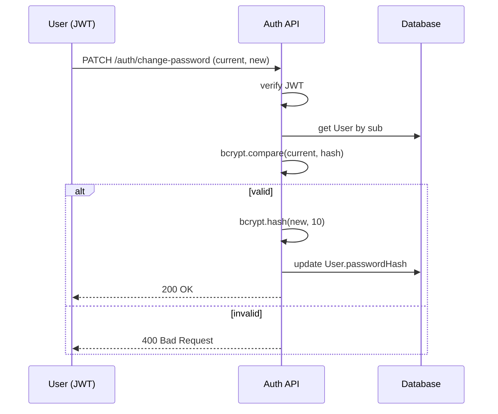

# Documentación Técnica — Autenticación y Acceso

Este documento describe la especificación técnica para los flujos de **inicio de sesión**, **recuperación de contraseña** y **cambio de contraseña**.  
---

## 1) Resumen técnico

- Autenticación con **JWT**.
- Hash de contraseñas con **bcrypt (10 salt rounds)**.
- **Lockout** tras **3 intentos fallidos** (bloqueo temporal por `lockedUntil`).
- **Tokens de recuperación** de un solo uso, con **expiración de 15 minutos**.
- El **bloqueo temporal** se gestiona fuera de `User` (en `LoginSecurity`).  
- **Soft delete**: si `deletedAt` se setea, el `status` de `User` debe ser `inactive`.

---

## 2) Modelos (TypeScript, en inglés)

> Notas de diseño:
> - `isAdmin: boolean` (exclusivo). Si `isAdmin === true`, `roles` debe estar vacío.
> - `roles`: `OWNER`, `TENANT`, `ACCOUNTANT`.
> - `phoneNumber`, `address`, `rfc` son obligatorios **solo** si el usuario tiene rol `OWNER` o `TENANT`.
> - Unicidad: `email` siempre único. `phoneNumber` y `rfc` únicos **si existen**.
> - El lockout temporal vive en `LoginSecurity` (no en `User.status`).

```ts
// --- Roles domain ---
export type BusinessRole = 'OWNER' | 'TENANT' | 'ACCOUNTANT';

// --- Account status ---
export type AccountStatus = 'active' | 'inactive';

// --- Core user model (PII + audit + soft delete + admin flag) ---
export interface User {
  id: string;                 // UUID v4
  email: string;              // unique, lowercased
  passwordHash: string;       // bcrypt, 10 salt rounds
  isAdmin: boolean;           // admin capability flag (exclusive)
  roles: BusinessRole[];      // empty if isAdmin = true

  // PII
  name: string;               // first name
  lastName: string;           // last name
  phoneNumber?: string;       // required if OWNER or TENANT (unique when present)
  address?: string;           // required if OWNER or TENANT
  rfc?: string;               // required if OWNER or TENANT (unique when present)

  // Account status
  status: AccountStatus;      // 'active' | 'inactive'

  // Audit
  createdAt: Date;
  createdBy: string;          // userId or 'system'
  updatedAt: Date | null;
  updatedBy: string | null;
  deletedAt: Date | null;     // when set => status MUST be 'inactive'
}
```

```ts
// --- Login attempts & lockout (outside User) ---
export interface LoginSecurity {
  userId: string;             // FK -> User.id (unique)
  failedAttempts: number;     // increments on failed logins
  lockedUntil: Date | null;   // if set and in the future => cannot login
  lastFailedAt: Date | null;
  lastSuccessAt: Date | null;

  updatedAt: Date;            // touch on every change
}
```

```ts
// --- Password recovery token (single-use) ---
export interface PasswordRecoveryToken {
  id: string;                 // UUID v4
  userId: string;             // FK -> User.id (indexed)
  tokenHash: string;          // store only the hash (never raw token)
  expiresAt: Date;            // now + 15 minutes
  usedAt: Date | null;        // mark when consumed

  createdAt: Date;
}
```

```ts
// --- JWT payload ---
export interface JwtPayload {
  sub: string;                // userId
  roles: BusinessRole[];      
  isAdmin: boolean;
  iat?: number;
  exp?: number;               // e.g., 1h
}
```

---

## 3) Flujos técnicos

### 3.1 Login
1. `POST /auth/login` `{ email, password }`
2. Normalizar email a minúsculas.
3. Buscar `User` por email (no `deletedAt`) y `status = 'active'`.
4. Verificar en `LoginSecurity` si `lockedUntil > now` ⇒ rechazar.
5. Comparar `password` con `passwordHash` (bcrypt, 10).
6. **Éxito**:
   - `failedAttempts = 0`, `lockedUntil = null`, `lastSuccessAt = now`.
   - Emitir **JWT** (`sub`, `roles`, `isAdmin`, `exp ~ 1h`).
7. **Fallo**:
   - Incrementar `failedAttempts`.
   - Si `failedAttempts >= 3`, `lockedUntil = now + 15m`.
   - Actualizar `lastFailedAt`.

> Error siempre genérico: “credenciales inválidas”.

### 3.2 Recuperación de contraseña
1. `POST /auth/recover` `{ email }`
2. Si el usuario existe y está activo, generar token aleatorio:
   - Guardar **hash** del token en `PasswordRecoveryToken`.
   - `expiresAt = now + 15m`, `usedAt = null`.
   - Enviar email con enlace `GET /auth/reset?token=<raw>`.
3. `PATCH /auth/reset` `{ token, newPassword }`
   - Validar token (hash, expiración, `usedAt == null`).
   - Hash de `newPassword`, actualizar `User.passwordHash`.
   - Marcar `usedAt = now`.
   - (Opcional) invalidar otras sesiones.

### 3.3 Cambio de contraseña (autenticado)
1. `PATCH /auth/change-password` `{ currentPassword, newPassword }`
2. Validar JWT.
3. Verificar `currentPassword` con bcrypt.
4. Validar política de contraseña y actualizar hash.
5. (Opcional) invalidar otras sesiones.

---

## 4) Reglas técnicas y políticas

```ts
export const AUTH_CONFIG = {
  bcryptRounds: 10,
  jwtExpiryMinutes: 60,
  recoveryTokenExpiryMinutes: 15,
  maxFailedAttempts: 3,
  lockoutMinutes: 15,
  passwordPolicy: {
    minLength: 8,
    requireUppercase: true,
    requireLowercase: true,
    requireNumber: true,
    requireSymbol: false,
  },
};
```

- **Soft delete:** si `deletedAt` se setea ⇒ `status = 'inactive'`.
- **Exclusividad admin:** `isAdmin === true` ⇒ `roles = []`.
- **Obligatoriedad por rol (OWNER/TENANT):** `phoneNumber`, `address`, `rfc` requeridos.

---

## 5) Endpoints

| Método | Endpoint                | Auth | Descripción |
|-------:|-------------------------|------|-------------|
| POST   | `/auth/login`           | No   | Iniciar sesión (devuelve JWT) |
| POST   | `/auth/recover`         | No   | Solicitar recuperación de contraseña |
| PATCH  | `/auth/reset`           | No   | Establecer nueva contraseña con token |
| PATCH  | `/auth/change-password` | JWT  | Cambiar contraseña (autenticado) |

**Respuestas de error (guía):**
- Login: mensaje genérico, no detallar si falló email o contraseña.
- Reset: manejar expirado/ya usado como error de validación estándar.

---

## 6) Validaciones de formato

```ts
// Email (reasonable pattern + lowercase normalization):
export const EMAIL_REGEX =
  /^[^\s@]+@[^\s@]+\.[^\s@]{2,}$/i;

// Phone (E.164 simple): +[country][subscriber], up to 15 digits total
export const PHONE_E164_REGEX =
  /^\+?[1-9]\d{1,14}$/;

// RFC (México) simplificado: persona moral/física
export const RFC_MX_REGEX =
  /^([A-ZÑ&]{3,4})\d{6}[A-Z0-9]{3}$/i;
```

- **Email**: normalizar a minúsculas antes de persistir.
- **RFC**: el patrón es práctico; si requieres validación avanzada de homoclave/fecha, se puede ampliar.
- **Teléfono**: recomendable normalizar a **E.164** (si se usa formato local, definir normalizador MX).

---

## 7) Índices y constraints

- `User.email` ⇒ **UNIQUE** (case-insensitive).
- `User.phoneNumber` ⇒ **UNIQUE WHERE phoneNumber IS NOT NULL**.
- `User.rfc` ⇒ **UNIQUE WHERE rfc IS NOT NULL**.
- Índices recomendados:
  - `PasswordRecoveryToken (userId, expiresAt)`
  - `LoginSecurity (userId UNIQUE, lockedUntil)`

> Las reglas “obligatorias por rol” se validan en **capa de dominio** (no en DB), ya que `roles` es un array.

---

## 8) Diagramas de secuencia (Mermaid)

### 8.1 Login
```mermaid
sequenceDiagram
  participant U as User
  participant API as Auth API
  participant DB as Database

  U->>API: POST /auth/login (email, password)
  API->>DB: get User by email + LoginSecurity
  DB-->>API: User, LoginSecurity
  API->>API: check lockedUntil / status
  API->>API: bcrypt.compare(password, passwordHash)
  alt valid
    API->>DB: reset failedAttempts, clear lockedUntil, set lastSuccessAt
    API->>API: issue JWT (sub, roles, isAdmin, exp)
    API-->>U: 200 OK + JWT
  else invalid
    API->>DB: increment failedAttempts; set lockedUntil if >= 3
    API-->>U: 401 Unauthorized (generic)
  end
```

### 8.2 Password Recovery
```mermaid
sequenceDiagram
  participant U as User
  participant API as Auth API
  participant DB as Database
  participant M as Mailer

  U->>API: POST /auth/recover (email)
  API->>DB: get User by email
  API->>API: generate random token (hash)
  API->>DB: insert PasswordRecoveryToken (expiresAt = now + 15m)
  API->>M: send email with link
  API-->>U: 200 Accepted

  U->>API: PATCH /auth/reset (token, newPassword)
  API->>DB: find token by hash; validate expiry & unused
  API->>API: bcrypt.hash(newPassword, 10)
  API->>DB: update User.passwordHash; mark token.usedAt = now
  API-->>U: 200 OK
```

### 8.3 Change Password

