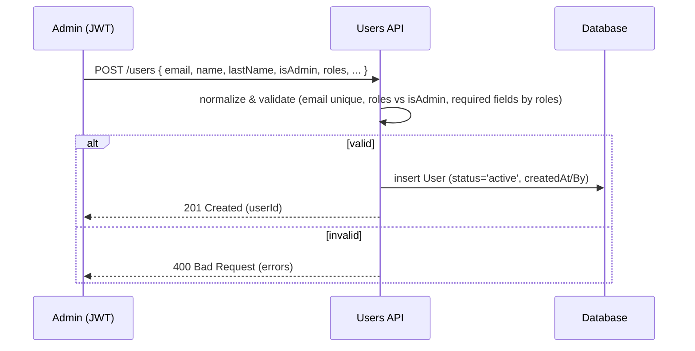
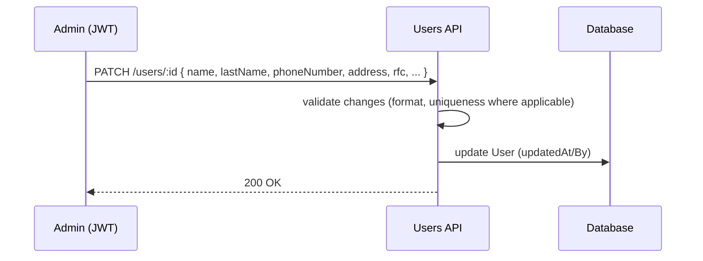
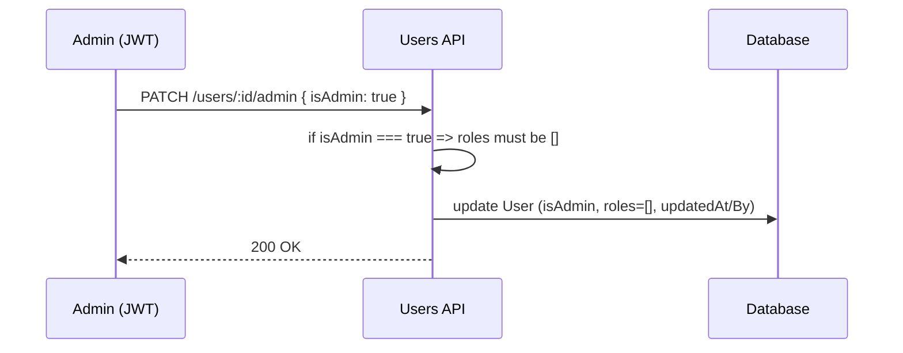
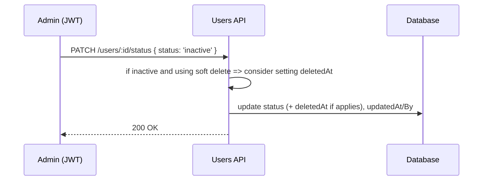

# Documentación Técnica — Gestión de Usuarios

Este documento describe la especificación técnica para el **Caso de Uso: Gestión de Usuarios** (alta, edición, asignación/remoción de roles y desactivación/eliminación).  
Este módulo se apoya en los modelos definidos en *Autenticación y Acceso*.

---

## 1) Alcance y objetivos

- Crear, editar y desactivar/eliminar cuentas de [[Usuario]].
- Asignar y remover [[Rol]]es de negocio (OWNER, TENANT, ACCOUNTANT).
- Mantener consistencia con reglas funcionales (exclusividad de **isAdmin**, requerimientos por rol, unicidad).
- Preservar auditoría: quién crea/edita/elimina y cuándo.

---

## 2) Modelos reutilizados y extensiones (TypeScript)

> Se reutilizan los modelos `User`, `LoginSecurity` y las reglas de autenticación.  
> A continuación se muestran los modelos base con notas específicas para Gestión de Usuarios.

```ts
export type BusinessRole = 'OWNER' | 'TENANT' | 'ACCOUNTANT';
export type AccountStatus = 'active' | 'inactive';

export interface User {
  id: string;                 // UUID v4
  email: string;              // unique, lowercased
  passwordHash: string;       // bcrypt, 10 salt rounds
  isAdmin: boolean;           // exclusive flag: if true => roles must be empty
  roles: BusinessRole[];      // if isAdmin === true => []

  // PII
  name: string;
  lastName: string;
  phoneNumber?: string;       // required if roles includes OWNER or TENANT (unique when present)
  address?: string;           // required if roles includes OWNER or TENANT
  rfc?: string;               // required if roles includes OWNER or TENANT (unique when present)

  // Account status
  status: AccountStatus;      // 'active' | 'inactive'

  // Audit
  createdAt: Date;
  createdBy: string;          // userId or 'system'
  updatedAt: Date | null;
  updatedBy: string | null;
  deletedAt: Date | null;     // when set => status MUST be 'inactive'
}
```

---

## 3) Reglas y validaciones de dominio

**Exclusividad de administrador**
- `isAdmin === true` ⇒ `roles = []` (no puede combinarse con roles de negocio).
- `isAdmin === false` ⇒ `roles` puede incluir {OWNER, TENANT, ACCOUNTANT}.

**Obligatoriedad por rol**
- Si `roles` incluye `OWNER` o `TENANT` ⇒ `phoneNumber`, `address`, `rfc` **obligatorios**.

**Unicidad**
- `email` **único** (case-insensitive).
- `phoneNumber` **único cuando existe**.
- `rfc` **único cuando existe**.

**Soft delete**
- Al setear `deletedAt` ⇒ forzar `status = 'inactive'`.
- La eliminación física (hard delete) solo si no hay relaciones que lo impidan (estrategia opcional).

**Cambio de roles y consistencia**
- Al **asignar** `OWNER` o `TENANT`: validar campos obligatorios; si faltan, rechazar.
- Al **remover** `OWNER`/`TENANT`: se permite dejar `phoneNumber`/`address`/`rfc` en null **si** no hay otras reglas que lo requieran; no borrar históricos/facturas.
- Al marcar `isAdmin = true`: limpiar `roles` si no está vacío.

**Auditoría**
- En cada operación (alta/edición/roles/eliminación) setear `updatedAt`/`updatedBy` y/o `createdAt`/`createdBy` según corresponda.

---

## 4) Validaciones de formato (reutilización)

```ts
export const EMAIL_REGEX = /^[^\s@]+@[^\s@]+\.[^\s@]{2,}$/i;
export const PHONE_E164_REGEX = /^\+?[1-9]\d{1,14}$/;
export const RFC_MX_REGEX = /^([A-ZÑ&]{3,4})\d{6}[A-Z0-9]{3}$/i;
```

- **Email**: normalizar a minúsculas antes de persistir.
- **RFC**: patrón práctico; puede ampliarse para validar fecha/homoclave.
- **Teléfono**: preferible normalizar a **E.164**.

---

## 5) Endpoints (REST sugeridos)

> Puedes exponer equivalentes GraphQL (mutations/queries) con los mismos invariantes.

| Method | Endpoint              | Auth | Purpose |
|-------:|-----------------------|------|---------|
| GET    | `/users`              | JWT  | Listado paginado/filtrado |
| GET    | `/users/:id`          | JWT  | Obtener detalle |
| POST   | `/users`              | JWT  | Crear usuario |
| PATCH  | `/users/:id`          | JWT  | Editar usuario |
| PATCH  | `/users/:id/roles`    | JWT  | Asignar/remover roles |
| PATCH  | `/users/:id/admin`    | JWT  | Activar/desactivar `isAdmin` |
| PATCH  | `/users/:id/status`   | JWT  | Activar/desactivar usuario |
| DELETE | `/users/:id`          | JWT  | Eliminar (soft delete) |

**Notas de seguridad**
- Solo **isAdmin=true** puede usar endpoints de gestión de usuarios.
- Auditar todas las operaciones. Enmascarar datos sensibles en logs.

---

## 6) Flujos técnicos (secuencias)

### 6.1 Alta de usuario


### 6.2 Edición de usuario


### 6.3 Asignación de roles
```mermaid
sequenceDiagram
  participant A as Admin (JWT)
  participant API as Users API
  participant DB as Database

  A->>API: PATCH /users/:id/roles { add: ['OWNER'], remove: [] }
  API->>API: ensure isAdmin === false
  API->>API: validate required fields for roles (phoneNumber/address/rfc)
  alt valid
    API->>DB: update roles; set updatedAt/By
    API-->>A: 200 OK
  else invalid
    API-->>A: 400 Bad Request (errors)
  end
```

### 6.4 Remoción de roles
```mermaid
sequenceDiagram
  participant A as Admin (JWT)
  participant API as Users API
  participant DB as Database

  A->>API: PATCH /users/:id/roles { remove: ['TENANT'] }
  API->>API: validate that at least one role remains OR isAdmin === true
  API->>DB: update roles; set updatedAt/By
  API-->>A: 200 OK
```

### 6.5 Activar/Desactivar isAdmin


### 6.6 Activar/Desactivar usuario


### 6.7 Eliminación (soft delete)
```mermaid
sequenceDiagram
  participant A as Admin (JWT)
  participant API as Users API
  participant DB as Database

  A->>API: DELETE /users/:id
  API->>API: validate domain rules (e.g., cascades per role handled elsewhere)
  API->>DB: set deletedAt=now; status='inactive'; updatedAt/By
  API-->>A: 200 OK
```

---

## 7) Reglas de autorización (resumen)

- Solo usuarios con `isAdmin === true` pueden gestionar otros usuarios.
- Un **admin** no puede modificarse a sí mismo para perder su único acceso de administración si es el **último admin activo** (regla de seguridad).
- Los cambios deben auditarse (quién y cuándo).

---

## 8) Índices y constraints (DB)

- `User.email` ⇒ **UNIQUE** (case-insensitive).
- `User.phoneNumber` ⇒ **UNIQUE WHERE phoneNumber IS NOT NULL**.
- `User.rfc` ⇒ **UNIQUE WHERE rfc IS NOT NULL**.
- Índices: `User (status)`, `User (isAdmin)` para filtros de backoffice.

---

## 9) Payloads de ejemplo (REST, en inglés)

```jsonc
// Create user (admin creating non-admin OWNER)
POST /users
{
  "email": "owner@example.com",
  "password": "TempPass!23",        // optional if you auto-invite
  "isAdmin": false,
  "roles": ["OWNER"],
  "name": "Lucia",
  "lastName": "Ramirez",
  "phoneNumber": "+5215512345678",
  "address": "Calle 1 #23, CDMX",
  "rfc": "RAML800101ABC"
}
```

```jsonc
// Assign role (add TENANT)
PATCH /users/:id/roles
{
  "add": ["TENANT"],
  "remove": []
}
```

```jsonc
// Toggle admin ON (forces roles=[])
PATCH /users/:id/admin
{ "isAdmin": true }
```

```jsonc
// Soft delete
DELETE /users/:id
// => system sets deletedAt and status='inactive'
```

---

## 10) Consideraciones adicionales

- **Invitación vs contraseña temporal**: se recomienda onboarding por invitación (enlace temporal) en lugar de contraseñas predefinidas.
- **Rate limiting** y auditoría en endpoints sensibles.
- **Paginación/búsqueda** en `/users` con filtros por `status`, `role`, `isAdmin`.
- **Internacionalización** de mensajes de error para backoffice.
