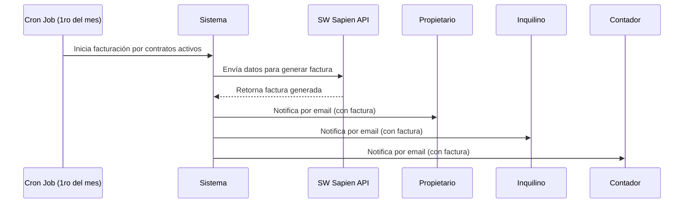

# 🧾 Flujo de Facturación Mensual

```mermaid
sequenceDiagram
    participant CronJob as Cron Job (1ro del mes)
    participant Sistema as Sistema
    participant SW as SW Sapien API
    participant Propietario
    participant Inquilino
    participant Contador

    CronJob->>Sistema: Inicia facturación por contratos activos
    Sistema->>SW: Envía datos para generar factura
    SW-->>Sistema: Retorna factura generada
    Sistema->>Propietario: Notifica por email (con factura)
    Sistema->>Inquilino: Notifica por email (con factura)
    Sistema->>Contador: Notifica por email (con factura)
```

Este diagrama representa el flujo automático que se ejecuta cada mes para emitir facturas por cada contrato activo.